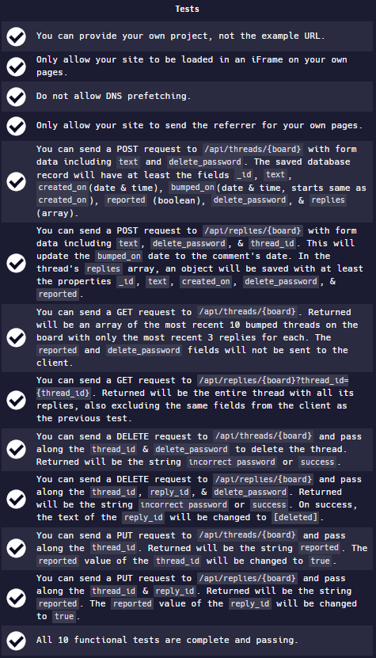

# [freeCodeCamp Information Security certification](https://www.freecodecamp.org/learn/information-security/)

## [Anonymous Message Board](https://www.freecodecamp.org/learn/information-security/information-security-projects/anonymous-message-board)

Working example: https://49Anonymous-Message-Board.raffraff1.repl.co

My git repo: https://github.com/Raff1010X/01.Roadmap

